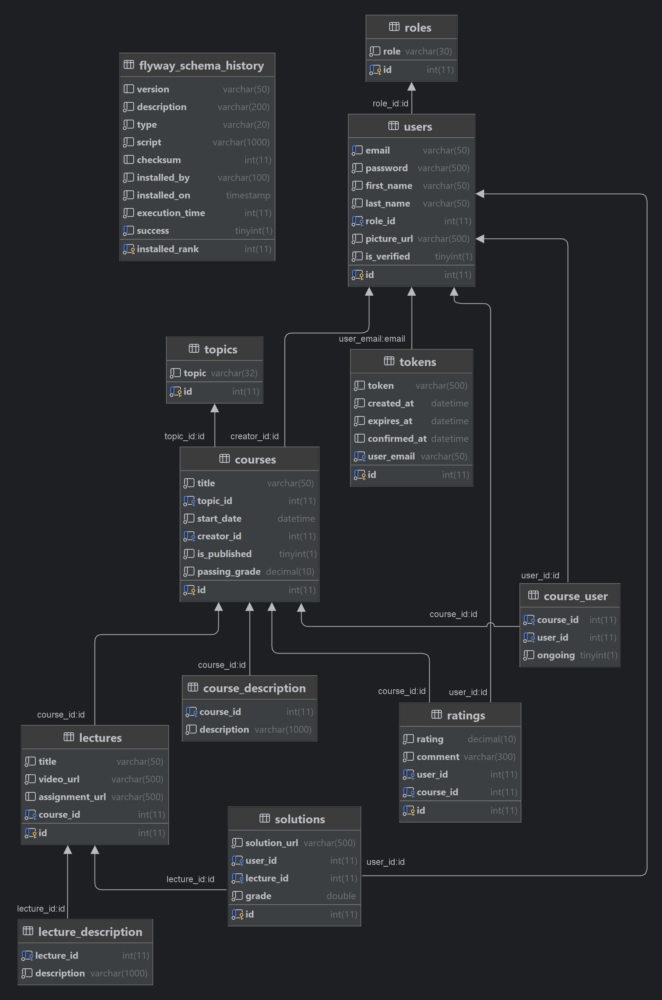

# Telerik Java Alpha53 - Team 2(Jully - December) 
- Atanas Manolev  

- Viktor Mitrev  

# Virtual teacher

__Virtual Teacher__ is a web-based application, which facilitates online tutoring. The platform allows users to register as teachers or students, enroll in video courses, and engage in a structured learning process. Key functionalities include video lectures, assignments, grading, and course ratings.
 Throughout the project we successfully implemented __additional functionalities__ such as:
- __Email verification__ - a newly registered user receives an email with an unique confirmation link, which is used to verify his/her registration.
- __Referral via email__ - a registered user can refer a friend and send a registration link via email through the UI of the application.
- __Graduation certificates__ - students who have successfully graduated from certain courses (received an average grade, which is higher than the passing grade) receive an automatically generated PDF certificate on their email. The certificate contains information about the course from which the student has graduated as well as his/her names.

## Swagger
 __Documentation__ is available at http://localhost:8080/swagger-ui/index.html when app is running

## Installation

### Prerequisites
The following list of software should be installed on your computer:
- [Java 17](https://www.oracle.com/java/technologies/javase/jdk17-archive-downloads.html)
- [MariaDB](https://mariadb.org/)

### Clone
- Clone or download the project on your local machine using `https://github.com/Virtual-Teacher-Project/VirtualTeacher.git`

### Database Replication
- Run the following script under: `VirtualTeacher/src/main/resources/db/migration/Initialize_DB.sql` in the project
- Database schema will be created and populated once the app is executed

### Login Details

- Student: username - `john.doe@example.com`,  password - `P@ssw0rd`
- Teacher: username - `mark.johnson@example.com`,  password - `M@rkPass` 
- Admin: username - `olivia.miller@example.com`,  password - `M!ll3r456` 
- Pending teacher: username - `emma.thomas@example.com`,  password - `Th0mas@123` 

## Technologies

- **Java 17**
- **Spring MVC**
- **JDBC Template**
- **SQL**
- **MariaDB**
- **Mockito**
- **JUnit**
- **Email verification** (utilising SMTP)
- [**WikiMedia API**](https://www.mediawiki.org/wiki/API:Main_page) (for retrieving up-to-date information about search criteria given by user)
- **HTML**
- **CSS**
- **Thymeleaf**
- [**Flyway**](https://flywaydb.org/)
## Optimizations

- __Scheduling with cron expression__ was applied for the process of examining the database for students that have successfully graduated from a certain course with an average grade higher than the passing grade and sending certificates to each of those students via email. As the process is very cumbersome, it is scheduled to be performed once per day when all certificates (if any) are send out, rather than being performed every time after a student graduates from a course.This way the process was streamlined to avoid frequent executions.
- __Asynchronous execution__ was used for sending emails, which allowed the application to continue with other tasks while the email sending process was performed in the background. This optimised performance by avoiding blockage of the main thread during potentially time-consuming email operations.

## Database Schema

